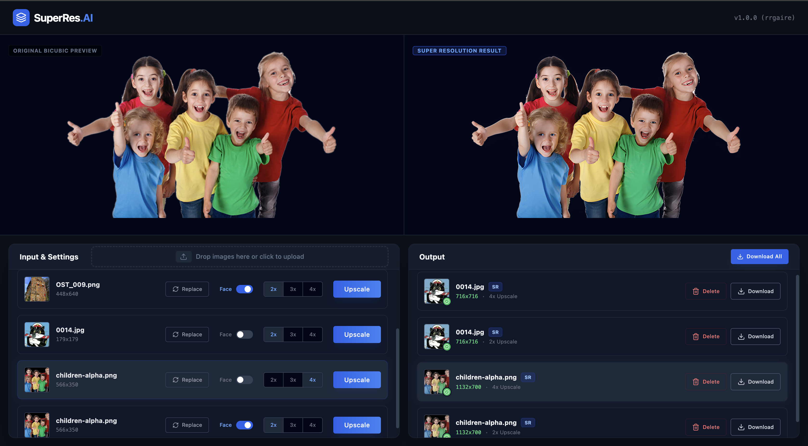
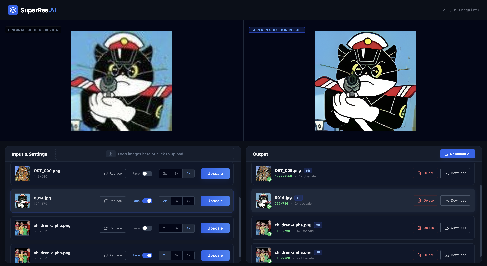

# SuperRes.ai

**High-Fidelity Real Image Super Resolution & Face Enhancement**

SuperRes.ai is a production-ready, containerized web application designed for high-fidelity enhancement of real-world low-resolution images. It integrates [Real-ESRGAN](https://github.com/xinntao/Real-ESRGAN) for real image super-resolution and [GFPGAN](https://github.com/TencentARC/GFPGAN) for automatic face detection and restoration, delivering crisp details while preserving natural texture.

<p align="center">
  
  
  
  
</p>

## Demo UI

<p align="center"></p>
<p align="center"></p>

## Key Features

### Real-World Super Resolution
Upscale images by 2×, 3×, or 4× using Real-ESRGAN architecture optimized for natural photos.

### Face Enhancement
Automatically detects and enhances faces with GFPGAN to fix blur, noise, artifacts, and low-quality features.


### Containerized & Portable

Runs in self-contained Docker containers, making the entire app portable, consistent, and easy to deploy anywhere.

### Full-Stack Architecture
- **Frontend**: React + Vite served through Nginx
- **Backend**: FastAPI + PyTorch + OpenCV
- **Routing**: Nginx reverse proxy (CORS-safe, production-ready)

## Project Structure

```
SuperRes.ai/
├── compose.yaml                  # Docker orchestration
├── .gitignore
├── backend/
│   ├── Dockerfile
│   ├── main.py                   # FastAPI entrypoint
│   ├── requirements.txt
│   └── core/
│       ├── upsampler/            # Real-ESRGAN logic
│       │   └── weights/          # Place SR model weights here
│       └── face_enhancer/        # GFPGAN logic
│           └── weights/          # Place face enhancement weights here
└── frontend/
    ├── Dockerfile
    ├── nginx.conf
    ├── package.json
    └── src/
```

## Installation & Setup

### Prerequisites
Ensure the following are installed:
- Docker
- Git

### 1. Clone the Repository

```bash
git clone https://github.com/rrgaire/SuperRes.ai.git
cd SuperRes.ai
```

### 2. Download Required Model Weights (IMPORTANT)

Model weights are not included due to file-size limits. You must download them manually and place them in the correct folders.

#### A. Real-ESRGAN (Super Resolution)
**Download (recommended)**: [RealESRGAN_x4plus.pth](https://github.com/xinntao/Real-ESRGAN/releases/download/v0.1.0/RealESRGAN_x4plus.pth)

Place it here:
```
backend/core/upsampler/weights/
```


#### B. GFPGAN (Face Enhancement)
**Download (recommended)**: [GFPGANv1.3.pth](https://github.com/TencentARC/GFPGAN/releases/download/v1.3.0/GFPGANv1.3.pth) | [parsing_parsenet.pth](https://github.com/xinntao/facexlib/releases/download/v0.2.0/parsing_bisenet.pth) | [Resnet50_Final.pth](https://github.com/xinntao/facexlib/releases/download/v0.1.0/detection_Resnet50_Final.pth)

Place it here:
```
backend/core/face_enhancer/weights/
```


**If weights are missing, the backend will crash with:**
- `FileNotFoundError`
- `Upsampler initialization failed`
- `GFPGAN initialization failed`
- or model loading errors

### 3. Run the Application with Docker Compose

```bash
docker compose up --build
```

The first run may take several minutes (PyTorch + Node builds).

### 4. Open the App

Once you see:
```
Application startup complete.
```

Go to: **http://localhost**

To stop:
```bash
docker compose down
```

## Development Workflow

### Frontend (React + Vite)

```bash
cd frontend
npm install
npm run dev
```

### Backend (FastAPI)

```bash
cd backend
pip install -r requirements.txt
uvicorn main:app --reload
```

## Acknowledgments

This project builds upon the amazing open-source work of:
- [Real-ESRGAN](https://github.com/xinntao/Real-ESRGAN)
- [GFPGAN](https://github.com/TencentARC/GFPGAN)
- [BasicSR](https://github.com/XPixelGroup/BasicSR)
- [FaceXLib](https://github.com/xinntao/facexlib)


## License

MIT License. You are free to use, modify, and distribute this project.